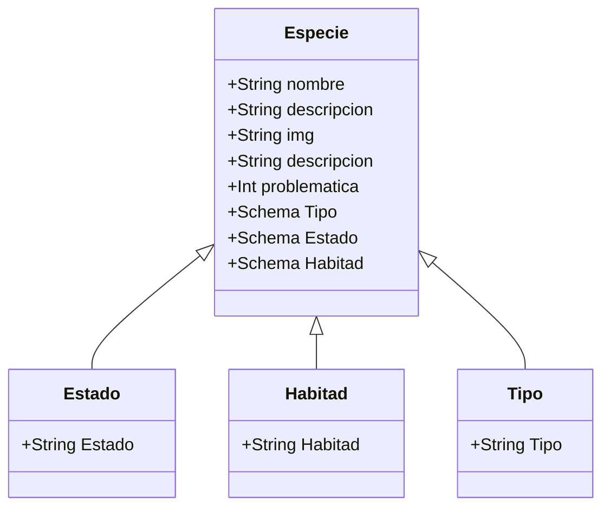
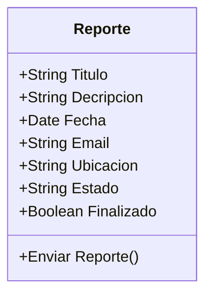

# HACK THE OCEAN - LAUNCHX
## Un proyecto de INNOVACCION VIRTUAL

Hack the Ocean es un hackathon con la iniciativa de implementar tecnologias de Frontend y Backend para explorar distintas problematicas, pensar en soluciones e implementarlas de manera que los conocimientos adquiridos por los Explorers tengan un aterrizaje al terreno practico y exploren nuevas soluciones a partir de su creatividad, conocimiento y objetivos a travez del trabajo en equipo.

## Woopas al Rescate 
Este proyecto apunta a crear consciencia de las distintas especies con a las que habitamos en el planeta, la situacion enla que se encuentran debido al cambio climatico, afectacion de su habitad, perdida de sus fuentes de alimento y la constante expansion del territorio humano.
Puedes vizualizar el proyecto aqui [Wooper al rescate](https://hacktheocean.azurewebsites.net/)

### Tecnologías utilizadas en este proyecto

**Node.js**

Node.js es un entorno de tiempo de ejecución de JavaScript de código abierto, multiplataforma y back-end que se ejecuta en el motor V8 y ejecuta código JavaScript fuera de un navegador web. Permita que los desarrolladores usen JavaScript para escribir herramientas de línea de comandos y para secuencias de comandos del lado del servidor, ejecutando scripts del lado del servidor para producir contenido dinámico de la página web antes de que la página se envíe al navegador web del usuario.

**MongoDB**

En lugar de guardar los datos en tablas, tal y como se hace en las bases de datos relacionales, MongoDB guarda estructuras de datos BSON (una especificación similar a JSON) con un esquema dinámico, haciendo que la integración de los datos en ciertas aplicaciones sea más fácil y rápida.

**ExpressJs**

Express es un marco de aplicación web Node.js mínimo y flexible que proporciona un sólido conjunto de características para aplicaciones web y móviles.

### Modelado de la API

### Un form padrísimo!

### Pruebas Unitarias
Se realizaron pruebas unitarias, implementadas mediante Jest, al módulo de helpers, como el método de subir archivo, así como a los controladores, es decir, los métodos de la clase especie, estado, habitad, tipo y uploads.

Para instalar las dependencias con el repositorio solo corre el comando:
>npm install
 