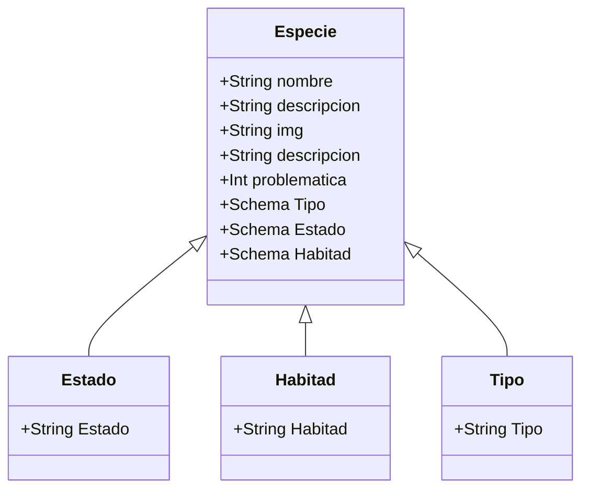
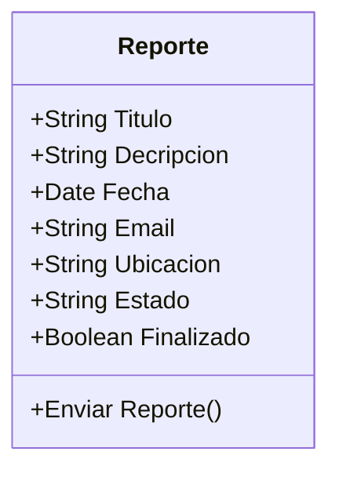

# HACK THE OCEAN - LAUNCHX
## Un proyecto de INNOVACCION VIRTUAL

Hack the Ocean es un hackathon con la iniciativa de implementar tecnologias de Frontend y Backend para explorar distintas problematicas, pensar en soluciones e implementarlas de manera que los conocimientos adquiridos por los Explorers tengan un aterrizaje al terreno practico y exploren nuevas soluciones a partir de su creatividad, conocimiento y objetivos a travez del trabajo en equipo.

## Woopas al Rescate 
Este proyecto apunta a crear consciencia de las distintas especies con a las que habitamos en el planeta, la situacion enla que se encuentran debido al cambio climatico, afectacion de su habitad, perdida de sus fuentes de alimento y la constante expansion del territorio humano.
Puedes vizualizar el proyecto aqui [Wooper al rescate](https://hacktheocean.azurewebsites.net/)

### Tecnologías utilizadas en este proyecto

**Node.js**

Node.js es un entorno de tiempo de ejecución de JavaScript de código abierto, multiplataforma y back-end que se ejecuta en el motor V8 y ejecuta código JavaScript fuera de un navegador web. Permita que los desarrolladores usen JavaScript para escribir herramientas de línea de comandos y para secuencias de comandos del lado del servidor, ejecutando scripts del lado del servidor para producir contenido dinámico de la página web antes de que la página se envíe al navegador web del usuario.

**MongoDB**

En lugar de guardar los datos en tablas, tal y como se hace en las bases de datos relacionales, MongoDB guarda estructuras de datos BSON (una especificación similar a JSON) con un esquema dinámico, haciendo que la integración de los datos en ciertas aplicaciones sea más fácil y rápida.

**ExpressJs**

Express es un marco de aplicación web Node.js mínimo y flexible que proporciona un sólido conjunto de características para aplicaciones web y móviles.

**ESLint**

Herramienta de código abierto enfocada en el proceso de "lintig" para JavaScript, siendo la más predominante para la tarea de "limpiar" código JavaScript tanto en el servidor (NodeJS) como en el navegador.

### Modelado de la API

### Un form padrísimo!

### Endpoints
#### Reportes
**https://hacktheoceanback.azurewebsites.net/api/reportes/ (método GET).** Regresa todos los reportes en la base de datos.
**https://hacktheoceanback.azurewebsites.net/api/reportes/:id (método GET).** Regresa el reporte según el id indicado en el parámetro.
**https://hacktheoceanback.azurewebsites.net/api/reportes/ (método POST).** Agrega un reporte a la base de datos.
**https://hacktheoceanback.azurewebsites.net/api/reportes/ (método PUT).** Actualiza un reporte en la base de datos.
| GET reportes | GET reportes/:id |
| --- | --- |
|   |  |

#### Tipos
**https://hacktheoceanback.azurewebsites.net/api/tipos/ (método GET).** Regresa todos los tipos de especies en la base de datos.
**https://hacktheoceanback.azurewebsites.net/api/tipos/:id (método GET).** Regresa el tipo de especie según el id indicado en el parámetro.

**https://hacktheoceanback.azurewebsites.net/api/tipos/ (método POST).** Agrega un tipo de especie a la base de datos.
**https://hacktheoceanback.azurewebsites.net/api/tipos/ (método PUT).** Actualiza un tipo de especie en la base de datos.
| GET tipos | GET tipos/:id |
| --- | --- |
|   |  |

#### Habitad
**https://hacktheoceanback.azurewebsites.net/api/habitad/ (método GET).** Regresa todos las habitats en la base de datos.
**https://hacktheoceanback.azurewebsites.net/api/habitad/:id (método GET).** Regresa el habitat según el id indicado en el parámetro.

**https://hacktheoceanback.azurewebsites.net/api/habitad/ (método POST).** Agrega un habitat a la base de datos.
**https://hacktheoceanback.azurewebsites.net/api/habitad/ (método PUT).** Actualiza un habitat en la base de datos.
| GET tipos | GET tipos/:id |
| --- | --- |
|   |  |

### Pruebas Unitarias
Se realizaron pruebas unitarias, implementadas mediante Jest, al módulo de helpers, como el método de subir archivo, así como a los controladores, es decir, los métodos de la clase especie, estado, habitad, tipo y uploads.

### GitHub Actions & Azure

Para instalar las dependencias con el repositorio solo corre el comando:
>npm install
 
